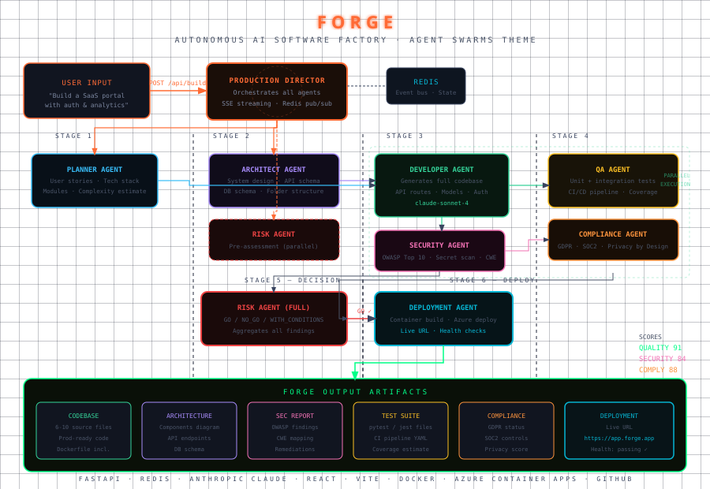

# ⬡ FORGE — Autonomous AI Software Factory

> **From requirement to production, autonomously.**
> A self-organizing swarm of 9 specialized AI agents that plan, architect, code, secure, test, and deploy software — with zero human intervention between input and live URL.

<div align="center">



**Microsoft Build AI Hackathon 2026 · Agent Swarms + AI-Powered Production Function**

</div>

---

## The Problem

Software delivery is still fundamentally manual. Even with AI assistants, a developer must:
- Translate a requirement into tasks (manual)
- Design a system architecture (manual)
- Write and review code (semi-automated)
- Run security audits (manual)
- Write tests (manual)
- Handle compliance checks (manual)
- Deploy and monitor (scripted but fragile)

Every one of these stages is a handoff — and every handoff is friction, delay, and human error. **FORGE eliminates every handoff.**

---

## What FORGE Does

You type a business requirement. FORGE's 9-agent swarm autonomously delivers:

| Output | What You Get |
|--------|-------------|
| 📋 **Project Plan** | User stories, tech stack, complexity estimate, timeline |
| 🏗️ **Architecture** | Component diagram, API endpoints, DB schema |
| 💻 **Codebase** | 6–10 production-quality source files (FastAPI/Express) |
| 🔐 **Security Report** | OWASP Top 10 audit, CWE mapping, remediations |
| 🧪 **Test Suite** | pytest/jest files, CI/CD pipeline YAML |
| ✅ **Compliance Report** | GDPR, SOC2, Privacy by Design score |
| ⚖️ **Risk Assessment** | GO / NO_GO / GO_WITH_CONDITIONS decision |
| 🚀 **Deployment** | Live staging URL, health checks, resource allocation |

---

## Agent Architecture

```
                          ┌─────────────────────────┐
                          │    PRODUCTION DIRECTOR   │
                          │  (Orchestrator · Redis)  │
                          └────────────┬────────────┘
                                       │
              ┌────────────────────────┼────────────────────┐
              ▼                        ▼                     ▼
      ┌──────────────┐      ┌──────────────────┐   ┌──────────────┐
      │   PLANNER    │      │   ARCHITECT       │   │    RISK      │
      │  User Stories│      │  System Design    │   │  Pre-assess  │
      └──────┬───────┘      └────────┬─────────┘   └──────────────┘
             │                       │
             └──────────┬────────────┘
                        ▼
              ┌──────────────────┐
              │   DEVELOPER      │   ← claude-sonnet-4
              │  Generates Code  │
              └──────┬──────┬───┘
                     │      │
           ┌─────────┘      └──────────┐
           ▼                           ▼
  ┌──────────────┐           ┌──────────────────┐
  │   SECURITY   │           │       QA          │
  │ OWASP + CWE  │           │  Tests + CI/CD    │
  └──────┬───────┘           └────────┬─────────┘
         │                            │
         └───────────┬────────────────┘
                     ▼
            ┌──────────────────┐
            │   COMPLIANCE     │
            │  GDPR · SOC2     │
            └────────┬─────────┘
                     ▼
            ┌──────────────────┐
            │      RISK        │   GO / NO_GO
            │  Final Decision  │──────────────┐
            └──────────────────┘              ▼
                                   ┌──────────────────┐
                                   │    DEPLOYMENT     │
                                   │  Azure Container  │
                                   │  Live URL + Health│
                                   └──────────────────┘
```

### Agent Roles

| Agent | Color | Responsibility |
|-------|-------|----------------|
| **Production Director** | 🟠 Orange | Orchestrates pipeline, manages parallelism, builds final report |
| **Planner** | 🔵 Cyan | Decomposes requirement into user stories, recommends tech stack |
| **Architect** | 🟣 Purple | Designs system components, API contracts, database schema |
| **Developer** | 🟢 Green | Generates complete, working production codebase via Claude API |
| **Security** | 🩷 Pink | OWASP Top 10 audit, secret scanning (regex + AI), CWE mapping |
| **QA** | 🟡 Yellow | Writes test files, estimates coverage, generates CI/CD YAML |
| **Compliance** | 🟠 Orange | GDPR/SOC2 audit, Privacy by Design scoring |
| **Risk** | 🔴 Red | Aggregates all findings → GO / NO_GO / GO_WITH_CONDITIONS |
| **Deployment** | 🩵 Cyan | Containerizes, deploys to Azure, runs health checks |

---

## Tech Stack

### Backend
- **FastAPI** — async Python API with Server-Sent Events (SSE) for real-time streaming
- **Redis** — agent event bus and run state store
- **Anthropic Claude Sonnet 4** — powers all 9 agents
- **Docker** — containerized deployment
- **Railway** — backend hosting

### Frontend
- **React 18 + Vite** — fast SPA
- **SVG animations** — live agent swarm visualization with hex nodes and traveling-dot edges
- **Server-Sent Events** — real-time agent feed without WebSocket overhead
- **Vercel** — frontend hosting

### Microsoft Ecosystem Alignment
- **GitHub** — source control and CI/CD trigger
- **Azure Container Apps** — target deployment platform
- **Azure Monitor** — observability (referenced in deployment output)
- **Azure DevOps** — CI pipeline target in generated test artifacts

---

## Live Demo


**Frontend:** `https://forge-ai.vercel.app`
**Backend:** `https://forge-api.railway.app`
**Health:** `https://forge-api.railway.app/api/health`

> Demo credentials not required — the app is fully public.

---

## Quickstart (Local)

### Prerequisites
- Docker + Docker Compose
- An Anthropic API key (`sk-ant-...`)

### 1. Clone
```bash
git clone https://github.com/atharv-mittal/forge
cd forge
```

### 2. Configure
```bash
cp .env.example .env
# Edit .env and set ANTHROPIC_API_KEY=sk-ant-...
```

### 3. Run
```bash
docker compose up
```

- Frontend: http://localhost:3000
- Backend API: http://localhost:8000
- API Docs: http://localhost:8000/docs

### Manual Setup (without Docker)

**Backend:**
```bash
cd backend
python -m venv venv && source venv/bin/activate
pip install -r requirements.txt
uvicorn main:app --reload --port 8000
```

**Frontend:**
```bash
cd frontend
cp .env.example .env.local
# Set VITE_BACKEND_URL=http://localhost:8000
npm install
npm run dev
```

---

## Deployment

### Backend → Railway
1. Create a new Railway project
2. Add a Redis service
3. Link your GitHub repo (set root to `/backend`)
4. Add environment variable: `ANTHROPIC_API_KEY`
5. Railway auto-detects the Dockerfile and deploys

### Frontend → Vercel
1. Import GitHub repo in Vercel dashboard
2. Set root directory to `frontend`
3. Add environment variable: `VITE_BACKEND_URL=https://your-app.railway.app`
4. Deploy

---

## API Reference

### Start a Build
```http
POST /api/build
Content-Type: application/json

{
  "requirement": "Build a leave management system with approval workflows",
  "stack": "python"
}
```

Response:
```json
{ "run_id": "abc-123", "status": "queued" }
```

### Stream Events (SSE)
```http
GET /api/stream/{run_id}
Accept: text/event-stream
```

Each event:
```json
{
  "type": "thinking|action|result|error",
  "agent": "Developer",
  "role": "Code Generator",
  "color": "#34D399",
  "message": "Generating production FastAPI codebase...",
  "ts": 1748123456.789
}
```

Final event types: `report` (full JSON report) then `done`.

### Get Full Result
```http
GET /api/result/{run_id}
```

---

## Project Structure

```
forge/
├── backend/
│   ├── main.py                  # FastAPI app, SSE streaming
│   ├── requirements.txt
│   ├── Dockerfile
│   ├── railway.toml
│   └── agents/
│       ├── base.py              # BaseAgent: emit/call_claude/parse_json
│       ├── director.py          # ProductionDirector — orchestrates all
│       ├── planner.py           # Requirements decomposition
│       ├── architect.py         # System design
│       ├── developer.py         # Code generation (Claude API)
│       ├── security.py          # OWASP audit + secret scan
│       ├── qa.py                # Test generation + CI config
│       ├── compliance.py        # GDPR/SOC2 audit
│       ├── risk.py              # Go/No-go decision
│       └── deployment.py        # Container deploy + health check
│
├── frontend/
│   ├── index.html               # Font imports, meta
│   ├── package.json
│   ├── vite.config.js
│   ├── vercel.json
│   └── src/
│       ├── App.jsx              # Main app, state management, SSE client
│       ├── index.css            # Design system, animations
│       └── components/
│           ├── SwarmGraph.jsx   # SVG hex-node agent visualization
│           └── OutputPanel.jsx  # Tabbed output: code/arch/security/tests/deploy
│
├── assets/
│   └── architecture.svg         # System architecture diagram
│
├── docker-compose.yml
├── .env.example
├── .gitignore
└── README.md
```

---

## Innovation: Why FORGE is Different

Most "AI coding assistants" give you tab-completion or a chat interface. **FORGE is fundamentally different:**

| Dimension | Traditional AI Code Tools | FORGE |
|-----------|--------------------------|-------|
| Input | A function / snippet | A business requirement |
| Output | Autocomplete | Full deployable system |
| Process | Human-in-the-loop | Autonomous agent swarm |
| Security | None | OWASP audit built-in |
| Compliance | None | GDPR/SOC2 check built-in |
| Tests | None | Full test suite generated |
| Deploy | Manual | Automated to staging |
| Governance | None | Full audit trail + risk gate |

FORGE doesn't assist a developer. **It replaces the entire pre-production workflow** for a standard business application.

---

## Evaluation Criteria Alignment

| Criterion | FORGE |
|-----------|-------|
| **Innovation** | First end-to-end autonomous software factory with built-in security, compliance, and risk gating |
| **Technical Complexity** | 9-agent orchestration, parallel execution, SSE streaming, real-time SVG visualization |
| **Working Prototype** | Fully deployed — live URL in demo section |
| **Real-World Impact** | Reduces a 3-4 week sprint to a 90-second automated pipeline |
| **Microsoft Ecosystem** | GitHub + Azure Container Apps + Azure Monitor + Azure DevOps CI target |
| **Demo Quality** | Live agent swarm visualization, streaming output, complete artifact tabs |

---

## Team

| Name | Role |
|------|------|
| **Atharv Mittal** | Solo — Full Stack + AI Architecture |

---

## License

MIT — built for Microsoft Build AI Hackathon 2026.
